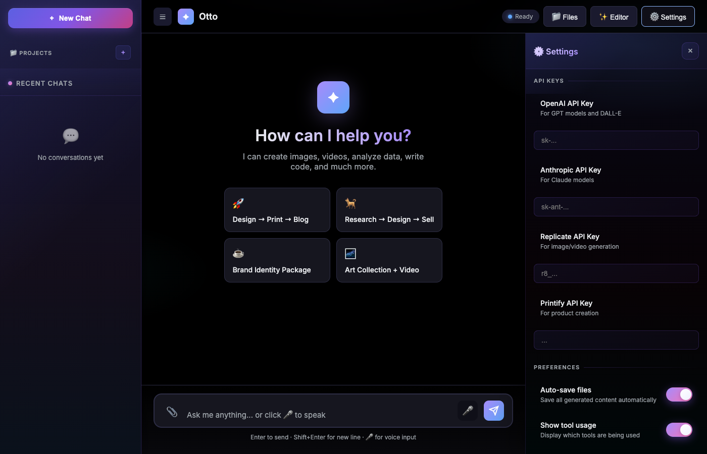
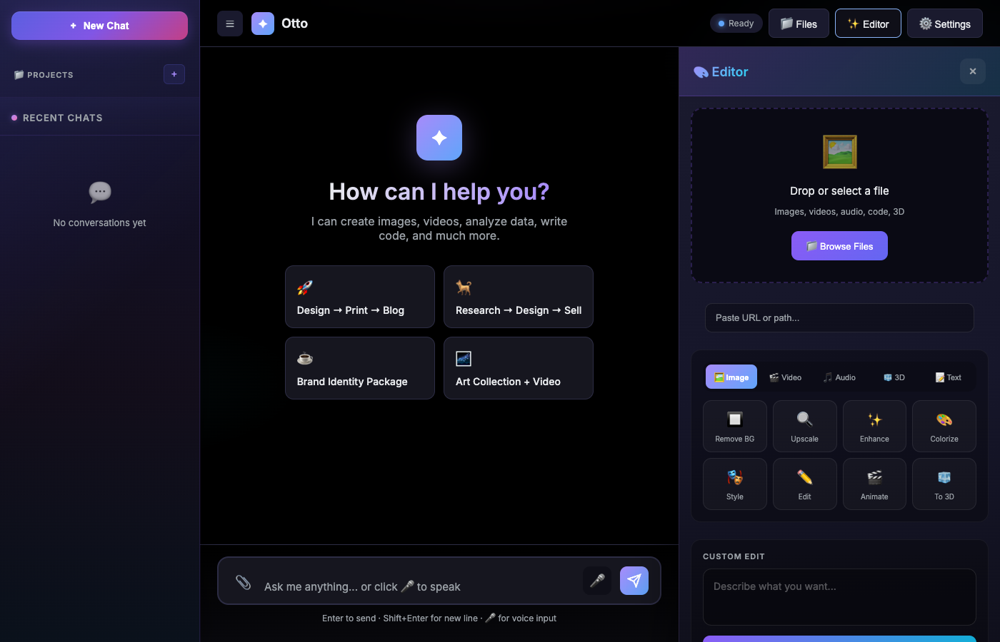

# 🤖 Otto Chat

> **Universal AI Business Platform** — Automate everything through conversation

Otto Chat is a sophisticated autonomous AI platform that combines Claude's intelligence with 80+ integrated tools. Generate stunning images and videos, create print-on-demand products, produce commercial content, manage e-commerce stores, and automate your entire creative business — all through natural conversation.


<p align="center">
  
  
  
</p>

---

## 📸 Screenshots

<p align="center">
  
  <br>
  <em>Modern chat interface with gradient sidebars and real-time progress tracking</em>
</p>

<p align="center">
  
  <br>
  <em>Intelligent AI responses powered by Claude Opus 4</em>
</p>

<p align="center">
  
  <br>
  <em>File management with colorful filter chips and premium styling</em>
</p>

<p align="center">
  
  <br>
  <em>Sleek settings panel with premium toggle controls</em>
</p>

<p align="center">
  
  <br>
  <em>Edit panel for managing and customizing content</em>
</p>

---

## ✨ Features

### 🧠 Super Intelligent Planning Agent
- **Claude Opus 4 Integration** — Powered by Anthropic's most capable model for complex reasoning
- **Multi-Step Autonomous Execution** — Breaks down complex tasks into parallel and sequential steps
- **Context Preservation** — Remembers your preferences (aspect ratios, styles, models) across conversations
- **Smart Dependency Resolution** — Automatically chains outputs between steps (e.g., generated images → products)
- **Batch Operations** — Create multiple products with different designs in a single request

### 🎨 Advanced Image Generation
- **15+ AI Models** — Flux Pro 1.1, Flux Dev, SDXL, Recraft V3, Ideogram V2, and more
- **Smart Aspect Ratios** — Portrait, landscape, square with automatic prompt mapping
- **Style Presets** — Photorealistic, artistic, cinematic, product photography, and more
- **Logo & Icon Generation** — Professional vector-style logos with Recraft V3
- **Background Removal** — AI-powered background removal for product images

### 🎬 Video Generation & Commercial Production
- **AI Video Generation** — Multiple models including Runway, Luma, Minimax, Kling
- **Cinematic Styles** — 5 premium presets: cinematic, commercial, luxury, dynamic, ambient
- **Promo Video Creation** — Apple/Nike/Tesla-quality commercial scripts and production
- **Automatic Enhancement** — AI prompts enhanced for professional film look
- **Multi-Scene Support** — Complex video projects with multiple scenes and transitions

### 🎵 Audio Generation
- **AI Music Creation** — Generate custom music, ambient sounds, and soundscapes
- **Voice Synthesis** — Text-to-speech with multiple voices and styles
- **Audio Processing** — Mix, edit, and enhance audio content
- **Commercial Audio** — Create jingles, background music, and voiceovers

### 🛍️ E-Commerce Integration
- **Printify** — Full print-on-demand workflow: design → product → publish
- **Smart Product Mapping** — Automatic mapping to 30+ product types (t-shirts, mugs, posters, framed art)
- **Framed Art Products** — Support for premium framed prints with multiple frame options
- **Multi-Product Batching** — Create multiple products with different designs simultaneously
- **Shopify** — Manage products, orders, customers, and inventory

### 🔍 Research & Intelligence
- **Web Search** — Google search via Serper API with smart result parsing
- **Competitive Intelligence** — Analyze competitors, market trends, and opportunities
- **Web Scraping** — Extract structured content from any webpage
- **News Aggregation** — Real-time news monitoring and summarization
- **Deep Research** — Comprehensive multi-source research with citations

### 📁 File Management
- **Smart Storage** — Organize files by category with automatic metadata
- **Cloud Ready** — Architecture supports S3, Google Cloud Storage
- **Asset Library** — Browse, search, and manage all generated content
- **Version Tracking** — Full file history with tags and descriptions

### 🎨 Modern UI/UX
- **Sleek Interface** — Modern, colorful design inspired by Canva and Gemini
- **Gradient Sidebars** — Beautiful purple/pink/teal color scheme with subtle animations
- **Real-Time Updates** — Live progress tracking for multi-step operations
- **Responsive Design** — Works seamlessly on desktop and tablet

### 🎙️ Voice Capabilities
- **Speech-to-Text** — OpenAI Whisper integration
- **Text-to-Speech** — Natural voice responses
- **Voice Commands** — Control Otto hands-free

### ⚙️ Easy Setup
- **Onboarding Wizard** — Step-by-step setup for first-time users
- **Settings Page** — Configure all integrations in one place
- **Connection Testing** — Verify API keys work before saving

---

## 🚀 Quick Start

### Prerequisites
- Python 3.11+
- [Anthropic API Key](https://console.anthropic.com/settings/keys) (required)

### Installation

```bash
# Clone the repository
git clone https://github.com/RhythrosaLabs/otto-chat.git
cd otto-chat

# Create virtual environment
python -m venv venv
source venv/bin/activate  # On Windows: venv\Scripts\activate

# Install dependencies
pip install -r requirements.txt

# Copy environment template
cp .env.example .env
```

### Configuration

Edit `.env` with your API keys:

```env
# Required - Core AI
ANTHROPIC_API_KEY=sk-ant-...

# Optional - Voice Features
OPENAI_API_KEY=sk-...

# Optional - Image Generation
REPLICATE_API_TOKEN=r8_...

# Optional - Print-on-Demand
PRINTIFY_API_TOKEN=...
PRINTIFY_SHOP_ID=...

# Optional - E-commerce
SHOPIFY_SHOP_NAME=your-store
SHOPIFY_ACCESS_TOKEN=shpat_...

# Optional - Web Search
SERPER_API_KEY=...
```

### Run

```bash
# Start the server
python -m uvicorn src.api.main:app --host 0.0.0.0 --port 8000

# Or with auto-reload for development
python -m uvicorn src.api.main:app --reload
```

Visit **http://localhost:8000** to start chatting!

> 💡 First-time users are automatically redirected to the onboarding wizard

---

## 🎯 Usage Examples

### Natural Language Commands

```
💬 "Create a tall portrait image of a mountain landscape using Flux Pro, 
    then make it into a framed art print"
   → Generates portrait image, maps to framed art product, publishes to Printify

💬 "Create 3 different t-shirt designs for a sunset beach theme"
   → Generates 3 unique images in parallel, creates 3 separate products

💬 "Make me a cinematic promo video for my new coffee brand"
   → Creates premium commercial script, generates video with luxury styling

💬 "Research the top AI startups of 2025 and create a detailed report"
   → Multi-source research, competitive analysis, formatted report

💬 "Generate a logo for 'Stellar Coffee' in a modern minimalist style"
   → Creates professional vector-style logo with Recraft V3

💬 "Create ambient background music for a meditation app"
   → Generates custom AI music with appropriate mood and duration

💬 "Make me another image like that last one but in landscape"
   → Remembers your previous style and model preferences
```

### Multi-Step Autonomous Workflows

Otto excels at complex, multi-step tasks that chain together:

```
1. User: "Launch a new product line of nature-themed wall art"

2. Otto automatically:
   ├── Generates 5 unique nature images (forest, ocean, mountain, desert, aurora)
   ├── Creates framed art products for each design
   ├── Writes compelling product descriptions
   ├── Sets appropriate pricing
   └── Publishes all to your Printify store
```

### API Endpoints

| Endpoint | Method | Description |
|----------|--------|-------------|
| `/` | GET | Web chat interface |
| `/onboarding` | GET | Setup wizard for new users |
| `/settings-page` | GET | Settings management |
| `/files-page` | GET | File browser |
| `/chat` | POST | Send chat message |
| `/voice` | POST | Voice input (audio) |
| `/tools` | GET | List all available tools |
| `/health` | GET | Health check |
| `/api/settings` | GET/PUT | Settings API |
| `/api/files/*` | * | File management API |
| `/api/connections/*` | * | Service connections API |

### REST API Example

```bash
# Send a chat message
curl -X POST http://localhost:8000/chat \
  -H "Content-Type: application/json" \
  -d '{"message": "Generate a sunset beach image"}'

# Check available tools
curl http://localhost:8000/tools

# Get connection status
curl http://localhost:8000/api/connections/status

# Upload a file
curl -X POST http://localhost:8000/api/files/upload \
  -F "file=@image.png" \
  -F "category=images"
```

---

## 🛠️ Architecture

```
otto-chat/
├── src/
│   ├── api/
│   │   ├── main.py              # FastAPI application & routes
│   │   ├── settings.py          # Settings API endpoints
│   │   ├── files.py             # File management API
│   │   └── connections.py       # Service connections API
│   │
│   ├── core/
│   │   ├── super_planning_agent.py  # Autonomous planning & context preservation
│   │   ├── execution_agent.py       # Step execution & dependency resolution
│   │   └── agent_orchestrator.py    # AI orchestration & tool dispatch
│   │
│   ├── tools/
│   │   ├── __init__.py          # Tool registry (80+ tools)
│   │   ├── printify.py          # Printify integration
│   │   ├── shopify.py           # Shopify integration
│   │   ├── image_generation.py  # AI image generation (15+ models)
│   │   ├── video_generation.py  # AI video generation (multiple models)
│   │   ├── promo_video.py       # Commercial production
│   │   ├── audio_generation.py  # AI audio & music generation
│   │   ├── research.py          # Web search & scraping
│   │   ├── browser.py           # Browser automation
│   │   ├── content.py           # Content generation
│   │   └── file_storage.py      # File management
│   │
│   ├── storage/
│   │   └── file_storage.py      # File storage backend
│   │
│   ├── utils/
│   │   ├── config.py            # Pydantic settings
│   │   └── logger.py            # Logging configuration
│   │
│   └── web/
│       ├── chat.html            # Main chat interface (modern UI)
│       ├── settings.html        # Settings page
│       ├── files.html           # File browser
│       └── onboarding.html      # Setup wizard
│
├── skills/                      # Modular skill packages
│   ├── business_operations/
│   ├── content_creation/
│   ├── competitive_intelligence/
│   └── ...
│
├── data/
│   ├── files/                   # Generated content storage
│   ├── brand_brain/             # Brand intelligence data
│   ├── agents/                  # Agent configurations
│   └── workflows/               # Saved workflows
│
├── requirements.txt
├── Dockerfile
├── docker-compose.yml
└── .env
```

---

## 🔧 Available Tools (80+ Total)

### 🎨 Image Generation Tools (15+)
| Tool | Description |
|------|-------------|
| `generate_image_flux_pro` | Flux Pro 1.1 (highest quality) |
| `generate_image_flux_dev` | Flux Dev (fast iteration) |
| `generate_image_sdxl` | Stable Diffusion XL |
| `generate_image_recraft` | Recraft V3 (logos, icons) |
| `generate_image_ideogram` | Ideogram V2 (text in images) |
| `generate_logo` | Professional logo creation |
| `generate_icon` | App/web icons |
| `upscale_image` | AI image upscaling |
| `remove_background` | Background removal |
| Multiple aspect ratios | Portrait (2:3), Landscape (3:2), Square (1:1), Custom |

### 🎬 Video Generation Tools (10+)
| Tool | Description |
|------|-------------|
| `generate_ai_video` | Multi-model video generation |
| `create_promo_video` | Commercial production |
| `generate_video_runway` | Runway Gen-3 Alpha |
| `generate_video_luma` | Luma Dream Machine |
| `generate_video_minimax` | Minimax video model |
| `generate_video_kling` | Kling AI video |
| Style presets | Cinematic, Commercial, Luxury, Dynamic, Ambient |

### 🎵 Audio Generation Tools
| Tool | Description |
|------|-------------|
| `generate_music` | AI music composition |
| `generate_ambient` | Ambient soundscapes |
| `text_to_speech` | Voice synthesis |
| `generate_voiceover` | Professional narration |

### 🖨️ Printify Tools (15+)
| Tool | Description |
|------|-------------|
| `get_printify_shops` | List all connected shops |
| `get_printify_products` | Get products from a shop |
| `create_printify_product` | Create new product |
| `upload_printify_image` | Upload design image |
| `publish_printify_product` | Publish to sales channel |
| `get_blueprints` | Get product templates |
| Product mapping | T-shirts, mugs, posters, framed art, hoodies, etc. |

### 🛒 Shopify Tools (12)
| Tool | Description |
|------|-------------|
| `get_shopify_products` | List store products |
| `create_shopify_product` | Create new product |
| `get_shopify_orders` | View orders |
| `get_shopify_customers` | List customers |
| `update_shopify_inventory` | Adjust inventory |

### 🔍 Research Tools (8)
| Tool | Description |
|------|-------------|
| `web_search` | Google search via Serper |
| `search_news` | News article search |
| `search_images` | Image search |
| `search_videos` | Video search |
| `scrape_webpage` | Extract page content |
| `scrape_structured` | Extract structured data |
| `get_page_links` | Extract all links |
| `summarize_url` | Summarize webpage |

### 🌐 Browser Tools (8)
| Tool | Description |
|------|-------------|
| `browser_navigate` | Open URL in browser |
| `browser_screenshot` | Capture page screenshot |
| `browser_click` | Click elements |
| `browser_type` | Enter text in fields |
| `browser_scroll` | Scroll page |
| `browser_extract` | Extract data from page |
| `browser_wait` | Wait for element |
| `browser_close` | Close browser |

### 📁 File Storage Tools (7)
| Tool | Description |
|------|-------------|
| `save_file` | Store file with metadata |
| `save_image_from_url` | Download and save image |
| `save_generated_image` | Save AI-generated image |
| `get_file` | Retrieve file by ID |
| `list_files` | Browse files by category |
| `delete_file` | Remove file |
| `get_storage_stats` | Storage statistics |

### ✍️ Content Tools (7)
| Tool | Description |
|------|-------------|
| `generate_blog_post` | AI blog writing |
| `generate_product_description` | E-commerce copy |
| `generate_social_post` | Social media content |
| `generate_email` | Email drafting |
| `summarize_text` | Text summarization |
| `rewrite_text` | Content rewriting |
| `generate_ideas` | Brainstorming |

---

## 🐳 Docker Deployment

### Quick Start with Docker

```bash
# Build and run
docker-compose up -d

# View logs
docker-compose logs -f otto

# Stop
docker-compose down
```

### docker-compose.yml

```yaml
version: '3.8'

services:
  otto:
    build: .
    container_name: otto-chat
    ports:
      - "8000:8000"
    env_file:
      - .env
    volumes:
      - ./data:/app/data
    restart: unless-stopped
    healthcheck:
      test: ["CMD", "curl", "-f", "http://localhost:8000/health"]
      interval: 30s
      timeout: 10s
      retries: 3
```

### Dockerfile

```dockerfile
FROM python:3.11-slim

WORKDIR /app

# Install system dependencies
RUN apt-get update && apt-get install -y \
    curl \
    && rm -rf /var/lib/apt/lists/*

# Install Python dependencies
COPY requirements.txt .
RUN pip install --no-cache-dir -r requirements.txt

# Copy application
COPY . .

# Create data directories
RUN mkdir -p data/files/images data/files/documents data/files/audio data/files/video

# Expose port
EXPOSE 8000

# Run application
CMD ["uvicorn", "src.api.main:app", "--host", "0.0.0.0", "--port", "8000"]
```

---

## 🔐 Security

- **Environment Variables** — API keys stored in `.env` (never committed)
- **CORS Configuration** — Configurable for production
- **Rate Limiting** — Built-in request throttling
- **Input Validation** — Pydantic models for all inputs
- **JWT Ready** — Authentication infrastructure in place

### Security Best Practices

```bash
# Never commit .env files
echo ".env" >> .gitignore

# Use secrets manager in production
# AWS Secrets Manager, HashiCorp Vault, etc.

# Restrict CORS in production
# Edit src/api/main.py allow_origins
```

---

## 📊 API Response Format

### Chat Response

```json
{
  "response": "I've generated your mountain landscape image...",
  "type": "success",
  "session_id": "abc123",
  "plan": {
    "steps": ["Generate image", "Save to storage", "Return result"],
    "current_step": 3,
    "completed": true
  },
  "results": [
    {
      "tool": "generate_image_flux_pro",
      "success": true,
      "data": {
        "url": "https://...",
        "file_id": "img_123"
      }
    }
  ]
}
```

### Error Response

```json
{
  "detail": "Error message here",
  "error_code": "TOOL_EXECUTION_FAILED",
  "tool": "generate_image_flux_pro"
}
```

---

## 🗺️ Roadmap

### ✅ Recently Completed
- [x] Super planning agent with autonomous execution
- [x] Context preservation across conversations
- [x] Multi-product batch creation with correct image mapping
- [x] Video generation with 5+ AI models
- [x] Cinematic video style presets
- [x] Premium commercial script generation
- [x] Framed art product support
- [x] Modern UI with Canva/Gemini-inspired design
- [x] Colorful gradient sidebars

### Coming Soon
- [ ] Multi-user authentication
- [ ] Workflow automation builder
- [ ] Scheduled tasks / cron jobs
- [ ] Plugin system for custom tools
- [ ] Webhook integrations
- [ ] Analytics dashboard

### Future
- [ ] Mobile app companion
- [ ] Voice-first mode
- [ ] Team collaboration
- [ ] Custom AI model support
- [ ] White-label deployment

---

## 🐛 Troubleshooting

### Common Issues

**Server won't start**
```bash
# Check Python version
python --version  # Should be 3.11+

# Check dependencies
pip install -r requirements.txt

# Check .env file exists
cat .env
```

**"Anthropic API key required"**
```bash
# Add to .env file
echo 'ANTHROPIC_API_KEY=sk-ant-...' >> .env
```

**Port 8000 already in use**
```bash
# Kill existing process
lsof -ti:8000 | xargs kill -9

# Or use different port
uvicorn src.api.main:app --port 8001
```

**Image generation failing**
```bash
# Check Replicate token
curl -H "Authorization: Token $REPLICATE_API_TOKEN" \
  https://api.replicate.com/v1/account
```

---

## 📚 Documentation

- [API Reference](docs/api.md)
- [Tool Development Guide](docs/tools.md)
- [Deployment Guide](docs/deployment.md)
- [Contributing](docs/contributing.md)

---

## 🤝 Contributing

This is a private repository. Contact the owner for contribution access.

---

## 📄 License

**Private** — All Rights Reserved

© 2024-2026 RhythrosaLabs

---

## 🙏 Acknowledgments

Built with amazing open-source projects and APIs:

- [Anthropic Claude](https://anthropic.com) — AI language model
- [FastAPI](https://fastapi.tiangolo.com) — Web framework
- [Replicate](https://replicate.com) — Image generation
- [Printify](https://printify.com) — Print-on-demand
- [Shopify](https://shopify.com) — E-commerce
- [Serper](https://serper.dev) — Search API
- [Pydantic](https://pydantic.dev) — Data validation

---

<p align="center">
  <strong>Built with ❤️ by <a href="https://github.com/RhythrosaLabs">RhythrosaLabs</a></strong>
</p>

<p align="center">
  <sub>Otto Chat — Your AI Business Partner</sub>
</p>
